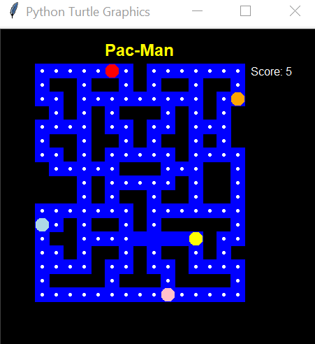

# Pacman
 Repository for a retro Pac-Man game, programmed with Python.
 
## Table of Contents
* [General info](#general-info)
* [Technologies](#technologies)
* [Setup](#setup)
* [Status](#status)
* [Inspiration](#inspiration)

## General info
This is repository contains a Pac-Man simulation. Use your keyboard to move around the maze and eat
all the dots in the map. Ghosts all around! Be aware. It must look like this when your run the code:



## Technologies
* Python 3.7.7
* Freegames 2.3.2
* Turtle and random were included with Python.

## Setup
To properly run (and play) this game, you'll need to import some Python packages: freegames, random and turtle.
As seen on this part of the code:

```Python
from random import choice
from turtle import *
from freegames import floor, vector
```

## Status
This code is already finished.

## Inspiration
This proyect is inspired by the Pac-Man game code at [Grant Jenks](http://www.grantjenks.com/docs/freegames/pacman.html) website.

## Collaborators
* [Edgar Castillo](https://github.com/EdgarCastilloRm)
* [Luis Martínez](https://github.com/A01570852)
